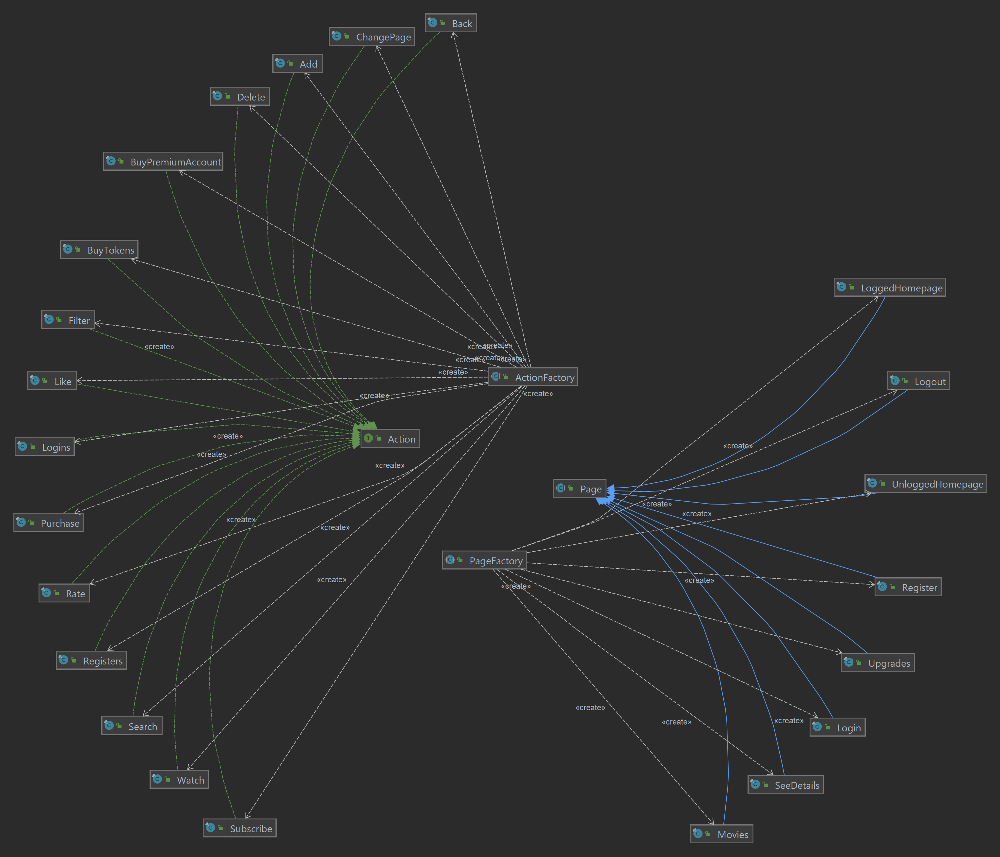
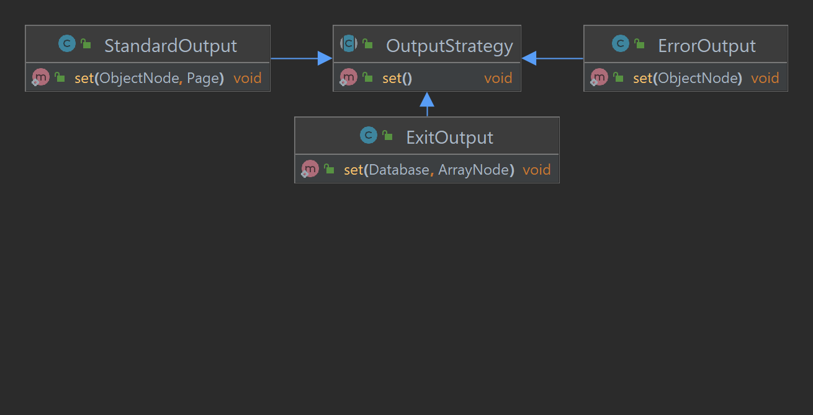
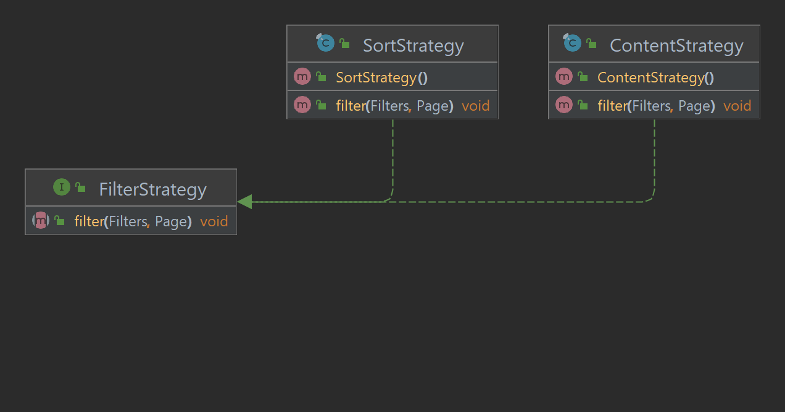
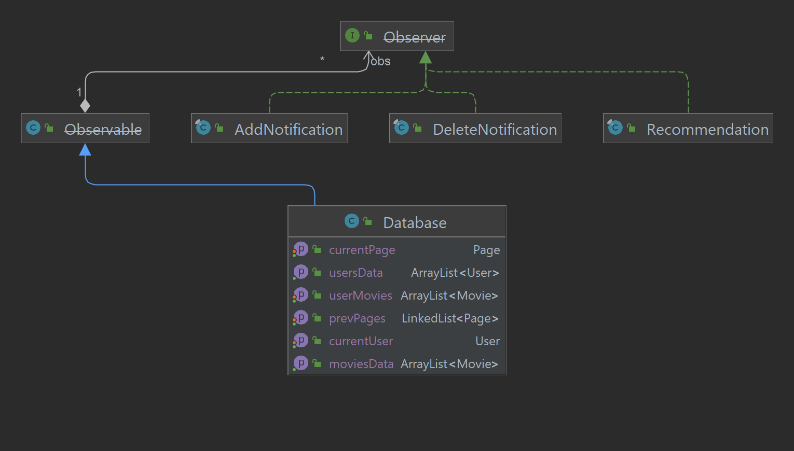
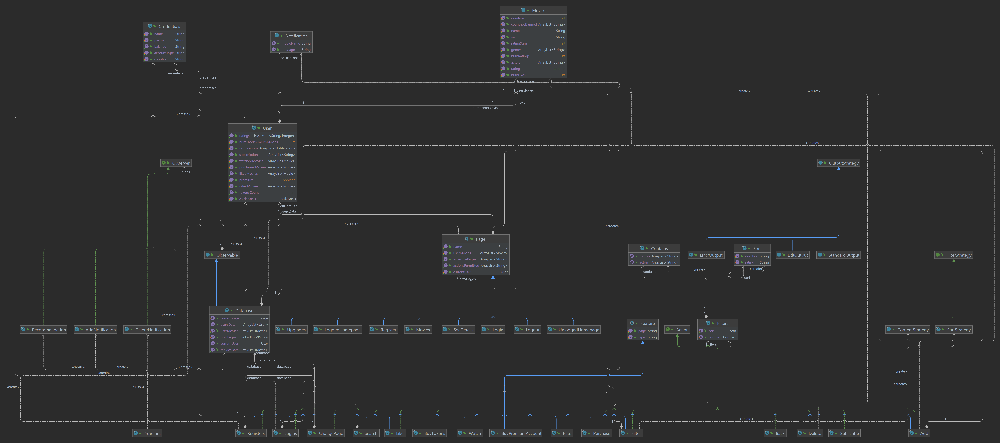

Name: Mirza Ana-Maria

Group: 321CA

# POO-TV

Description
-
Poo-Tv is a backend implementation of a platform for watching movies/series
from the user's perspective.
The basic functionalities offered for this platform include
logging in, registering, and moving on a specific page available.
From the movies page, the user can also search for a specific movie, filter the
movie list based on desired actors, genres, and even sort movies
based on duration and rating. In order to watch a movie, the user has to purchase
it for the standard price (2 tokens), or for free if the
user has premium account. A user can upgrade his account to
premium for 10 tokens and get 15 free movies, then he pays 2 tokens
for each purchase movie just like standard users. After purchasing
the movie, the user can watch it, then like and rate the
movie from 1 to 5. The tokens are taken explicitly by the
user from his balance. At the end, the user can log out and
the platform is restores to unauthenticated homepage.
Users also receive notifications when a new movie is added
to the platform, when a purchased movie is deleted and 
also notifications with recommendations of movies.

Implementation
-
For the implementation of this platform, a visitor pattern was used
to describe each action's behaviour on a specific page. Each action
performed by the user has a different effect based on the page he
is currently on. If the action does not have permission on a page,
the output given is an error, otherwise, the output given will contain
information about the current page, user, and movie list visible.
In order to eliminate duplicate code, the output was build in wrapper
classes using a strategy pattern.
For the filtering action of the current movie list, a strategy pattern
was used as well, to implement the different types of filtering (by content/sort).
The factory design pattern was used for the instantiation of specific
pages and actions. In order to send notifications, some observers were
added to notify users of changes in the database, and also
to recommend movies.

### Storing of input
The input consisting of actions given by the users, users available,
and movies are stored in the class 'Input' from package 'fileio'.
The initial input about users and movies available are also
stored in a database that stores the program's status. That is
the current user, current page, movies available, total movies on
the platform, and total users registered. In addition, the database
keeps a stack with pages visited by a logged user in order to allow
him to go back.

### Flow of the game
The platform is initialized at the beginning using a Singleton pattern
and initializes the database of the platform. In order to execute the
actions given by the user, the program uses a 'for' structure to
parse the input commands, create specific instance of action, and
calls the action's apply method which further calls the visit
method of the current page with given action.
Next, the action creates an output based on its effect on the page,
or an error if something was not permitted. The changes are stored
in the platform's database, and the next action is executed.

#### Visitor Pattern
For each action, the user visits a specific page. According to the
page's characteristics and permissions, the action can have different
effects or not even be executed. The output is then stored and displayed.

#### Factory Pattern
Whenever a new action is performed, the specific type of action
is created using a special class following the factory design
pattern to instantiate the specific action based on its type/feature
name. Also, for the creation of the specific page the user is on,
a factory class was used as well.

#### Strategy Pattern
In order to implement a common method for the creation of the output,
a wrapper class was used and extended for the error case, standard case
and the final output with the recommendation for the user.

The filtering of the movies was also implemented using the strategy
design pattern, offering filtering by content or through sorting.

#### Observer Pattern
As the database of movies is constantly updating, adding or removing
movies, the platform uses an observer design to notify users of these
updates. When a new movies is added to the platform, every user subscribed
to one of its genres is notified. Also, when a movie is deleted, every
user that purchased that movie is notified. At the end of the actions,
the logged user receives a notification containing a recommendation
of a movie, only if he has a premium account.

Platform Diagram
-

